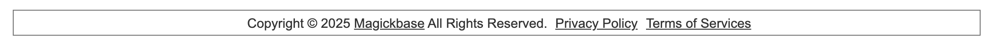
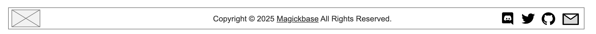
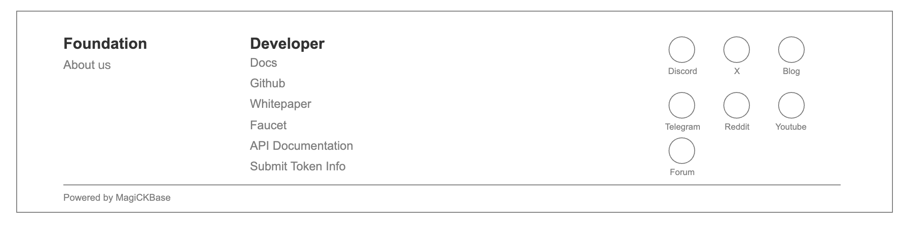

## 1. Footers Overview

This document describes the requirements for three types of footer components used across the Magickbase products. Each footer serves different UX purposes depending on the page context (minimal pages, informational pages, developer/portal hubs).

### 1.1. Goals

* **(P0)** Define reusable footer variants suitable for different user journeys and page contexts.
* **(P0)** Provide quick links to developer resources and community.

## 2. Version History / Requirement Tracking

| Version | Date       | Status | Notes                                        |
| ------- | ---------- | ------ | -------------------------------------------- |
| 1.0     | 2025-07-15 | Draft  | Initial specification for three footer types |

## 3. Page Constitution

### 3.1. Footer Type A: **Minimal Legal Footer**
  

* **Content**:
  * Copyright line
  * Link to Privacy Policy
  * Link to Terms of Services

### 3.2. Footer Type B: **Social + Copyright Footer**
  

**Use Case**: Main pages that need branding and limited social engagement.

* **Content**:

  * Centered copyright
  * Right-aligned social icons:
    * Discord
    * X (Twitter)
    * GitHub
    * Email

### 3.3. Footer Type C: **Full Developer Portal Footer**

  

**Use Case**: Homepage, Documentation site, dev portal, or community hub with full navigation.

* **Content**:
  * **Left Section:**
    * Foundation
      * About us
  * **Middle Section:**
    * Developer
      * Docs
      * GitHub
      * Whitepaper
      * Faucet
      * API Docs
      * Submit Token Info
  * **Right Section:**
    * Community links with icons:
      * Discord
      * X
      * Blog
      * Telegram
      * Reddit
      * YouTube
      * Forum
  * Bottom Row:
    * Horizontal line
    * “Powered by Magickbase”

