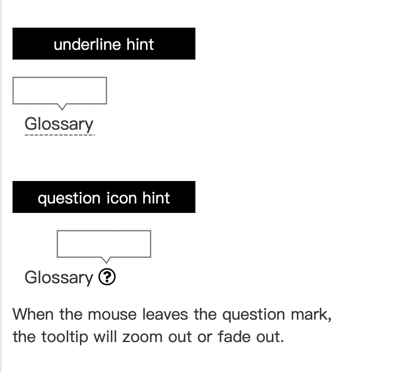

# Add field annotation

## Related Links:
- [Issue#269](https://github.com/Magickbase/ckb-explorer-public-issues/issues/269)
- [Prototype](https://vs0cjf.axshare.com/#id=4wptw3&p=_269_add_field_annotation&g=1)
- UI

## User Story
Users could check the definition of a word while browsing the explorer.

## Requirements
Two kinds of hints are provided here:
- the underlying hints
- the question icon hints

On the condition of page elements are neat, the UI designer can flexibly adapt to the actual position of the labels. The hint bubble will stay when the arrow move in.

  

All the glossary that should be explained are listed [here](/CKB-Explorer-PRDs/Glossary/Ongoing.md).