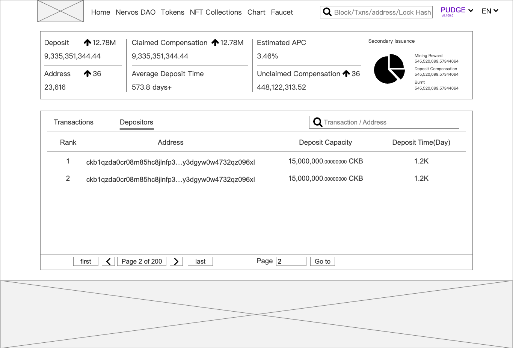

# PRD:Nervos DAO

- Page link:<https://explorer.nervos.org/nervosdao>

- Dashboard

  - Deposit: Total deposited and locked capacity. These data will be updated on 00:00 (UTC +8).
  - Claimed Compensation: Total claimed compensation by depositors.
  - Estimated APC: The estimated annual percentage rate change.
  - Addresses: The total number of the address who participate Nervos DAO. 参加质押的地址数量
  - Average Deposit Time: The average deposit time of all depositors.
  - Unclaimed Compensation: The total unclaimed compensation of all depositors, this amount of CKB could be withdraw from Nervos DAO.
  - Secondary Issuance
    - Mining Reward:
    - Deposit Compensation：
    - Burnt：

- Transaction
  - Deposit Transaction: User deposit CKB in this transaction. This kind of transaction will be marked with  in the reciever side.
  - Withdraw Transaction: User withdraw CKB in this transaction. This kind of transaction will be marked with  in the sender side. Hover on the icon to see the user withdraw details.
  - Nervos DAO compensation calculation: Calculate the compensation amount users could receive from his/her deposit.This kind of transaction will be marked with  in the receiver side.
  - Nervos DAO Withdraw Request: User make a withdraw request in this transaction. This kind of transaction will be marked with  in the sender side.

- Depositors

  All the dipositors will listed below , and ranked by the total deposit amount.
<!-- to do -->
