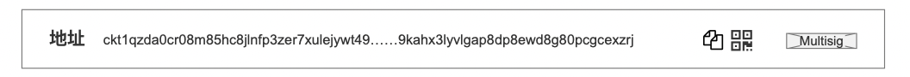

## 1. Page Overview
  

Address detail page is designed to provide developers, users, and auditors with a comprehensive view of an address's asset status especially the live cells, associated transactions, and address info.

### 1.1. Goals

* Present the total CKB balance and its disctribution for an address.
* Visualize live and different type Cell data.
* Offer complete transaction history with contextual direction, amount, and asset type.
* Enable developers to analyze address's lock scripts.
* Enable user to analyze address's transaction behavior.
* Support export functionality for transaction data.

## 2. Version History / Requirement Tracking

| Version | Date       | Status | Notes                       |
| ------- | ---------- | ------ | --------------------------- |
| 1.0     | 2025-07-10 | Draft  | Initial version based on UI |

## 3. Page Constitution

### 3.1. Address Header

  

* Page Title
* address hash
  * Display the full address (with middle hidden for brevity).
* Copy function
* QR code
  * For share
* Icons for lock scrpts.Like: 
  * "Multisig" label
  * Zero lock

### 3.2. • Overview Section
  

* **Total Balance**: Displays total CKB held of current address.
* **Occupied (balance_occupied)**: The total occupied CKB this address have invested in Nervos DAO.
* **Nervos DAO Deposits**: The total CKB this address have deposited in Nervos DAO
* **Nervos DAO Compensation**: The total CKB this address have received from Nervos DAO

### 3.3. • Tabbed View (Live Cell Tabs)
  

Tabs include:
* `Live Cell(s)`: All the live cells of current address
* `Fiber Channel`: All the live Fiber channel cells of current address
* `User Defined Token`: All the live UDT Token cells of current address
* `Inscription`: All the live Inscription cells of current address
* `RGB++`: All the live RGB++ cells of current address
* `Invalid Assets`: All the live RGB++ cells whose BTC UTXO is consumed unnormally. See more detail in RGB++ status description.
* `Deployment`: All the live deployment cells of current address

The tabs here are more like a "filter", which filter specific type of live cells based on the type of the cell.

Each tabs has 2 kind of views :
- List view
- Grid view

And it shows:
* Number of items (e.g. 2 live cells as shown in the demo).
* The attributes of the cells
  * Outpoint
    * Shows in which transaction the cell is created
  * Block number
    * Shows when the live cells begin
  * Capacity
  * Date / Created Time
    * Show the timestamp of when the cell is created

Also, the tabs provide 2 different sort methods:
*  by time
*  by amount

### 3.4. Cell Summary Footer

* **Live Cells** (unspent): Total number of live cells
* **Block Mined**: Total count (5,164,630)

### 3.5. Lock Script Section

* **Lock Script Hash**: Hash of lock script of current address.
* **Code Hash**: Script identifier.
* **Hash Type**: e.g., `type` or `data`.
* **Args**: Public key information stored in script arguments (hex-encoded).

### 3.6. Transaction History Section

2 tabs are provided here:
- Transactions
- Pending Transactions
  - Pending transactions will fade after 24h since the transaction is rejected.

* Sorting Options: by `Time`
* Display Modes: `Professional` / `Lite`
  * In the lite mode, we show below attributes of a transaction
    * Transaction Hash
    * Height
    * Time
    * Input & Output
    * Capacity Change
  * The main idea of Lite mode is to show the Capacity Change of current address in a transaction, so the unit will be CKB in uniform. We wont take UDT as unit here for now which will result in a mess currently.

Each transaction row includes:

* **Transaction Hash**: The uid of this transaction
* **Tx Tags**: If its a coinbase tx. e.g., `Cellbase for Block`
* **Time indicator**
  * **Block Hash** and **Height** (e.g., 8,636,028)
  * **Timestamp** (e.g., 5 mins ago)
* **Sender and Receiver Addresses** (directional arrows shown)
  * Highlight: Clear emphasis on the current address in transaction direction
* **Asset Type**: e.g., CKB or UDT (like BTC#62bc)
* **Amount Change**: 
  * The CKB amount change of the current address.
  * Positive (purple highlight) or negative (red)

### 3.7. Export Button

* Downloads transaction history for the current page.
  * Supports CSV format

