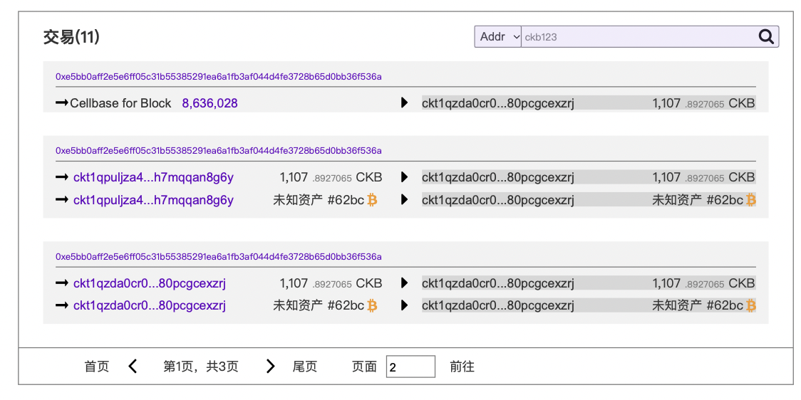

## 1. Page Overview

  

This page is the **Block Detail Page** for the CKB explorer. It allows users to inspect detailed block metadata and associated transactions. The interface is designed for developers, blockchain users, and data auditors to review historical on-chain data accurately.

### 1.1. **Goals**:

* (P0)Display full block-level metadata, and provide way to download it
* (P0)Provide a (paginated) list of transactions within the block.
* (P1)Allow navigation to transaction details or address views.
* (P2)Enable users to search and filter by address or tex hash inside a block.

## 2. Version History / Requirement Tracking

## 3. Page constitution

### 3.1. **Menu**

  * See [here](../GeneralComponents/Menu.md)

### 3.2. **Block Summary Panel**
  

* Block Hash
  * Show Block hash
  * Can copy
  * Can download Block Metadata
* Block Height
  * Click the arrows to jump to the previous or next block.
* Transactions
  * Show how many txs are in this block

* Size: Block Size (Bytes)
* Cycles
* Proposal Transactions
* Miner Reward
* Difficulty
* Nonce
* Uncle Count
* Miner
* Miner Message
* Epoch
* Epoch Start Number
* Block Index
  * Epoch length
  * Epoch index: Starts from 0
  * Block index: Starts from 1
* Timestamp
  * Should use the timezone based on user's location
* Transaction Root

### 3.3. **Transaction List Panel**

  

  * Coinbase Transaction (labeled)
    * The iniput cell of this transaction is usually the first one
    * The only Output is the miner
  * Standard Transactions
    * Transactions other than Coinbase Transaction,
    * Click this hash will lead you to [transaction detail page](TransactionDetailPage.md)
    * Address Inputs / Outputs
      * Click the address will lead you to the [address detail page](AddressDetail.md)
    * Value and Asset Type (CKB or UDT or BTC)
      * If the cell is known Token (all kinds of UDT, then ), then the unit should be the name of the Token like USDI.
      * If the cell is unknown Token , then the unit should be marked as: Unkown asset#62bc where #62bc is hash of the token.
      * #todo If the cell is NFT or Inscription, then the NFT Name or Inscription name should be labeled like: 
        * ckb1qzdcr9un5...704ldqqqztam9 Nervape Special
    * Search input for filtering by address/hash
  * Pagination controls (current page, total pages, next/previous)

