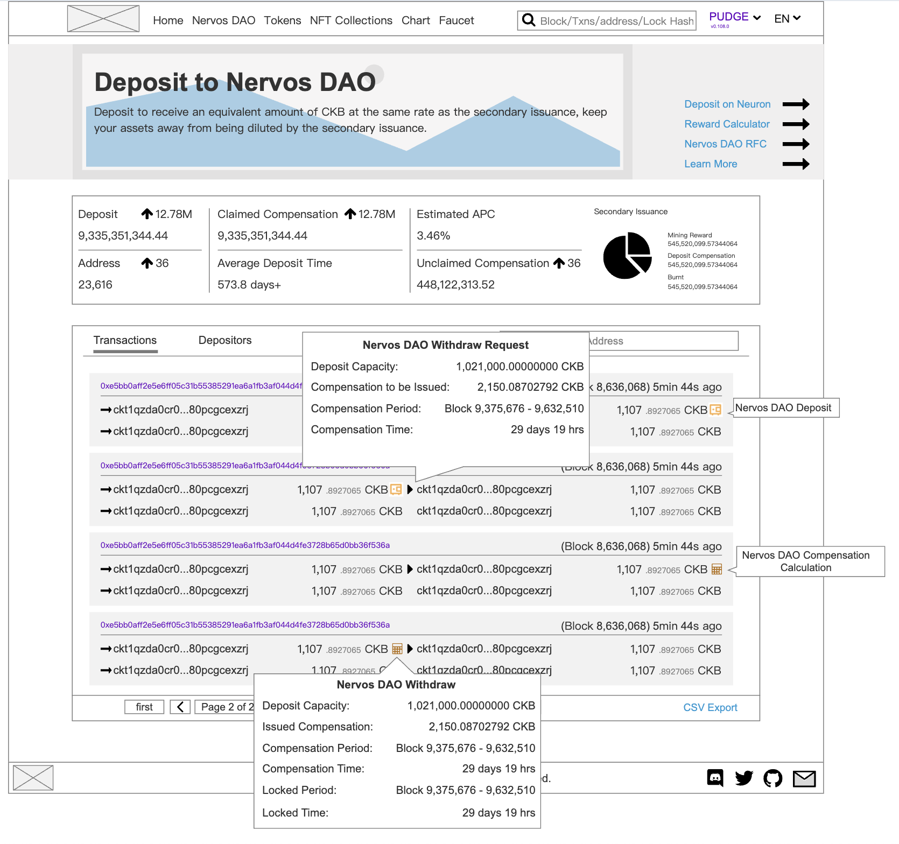
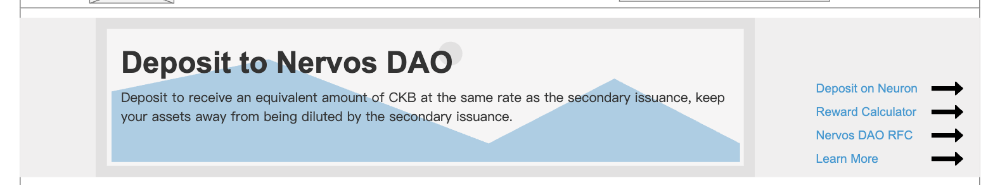
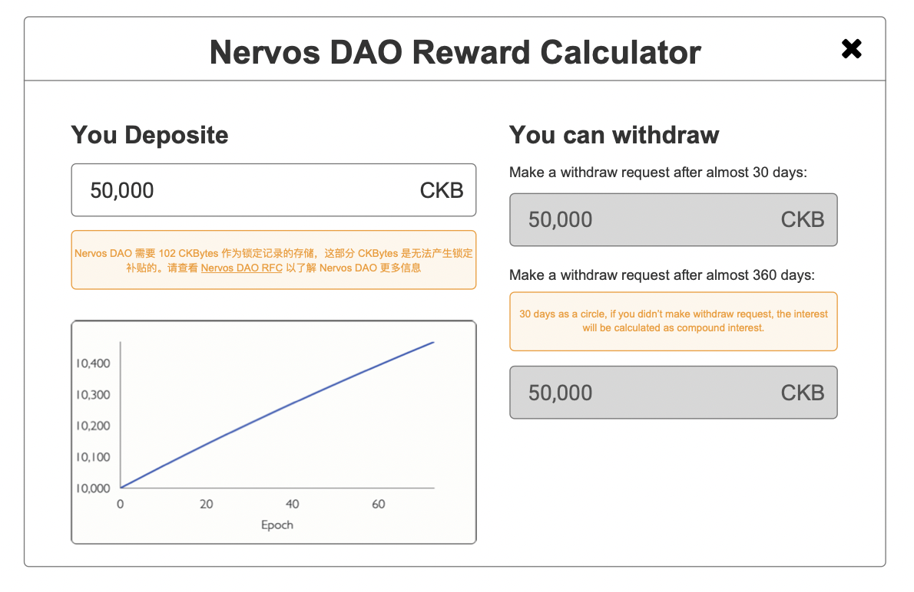
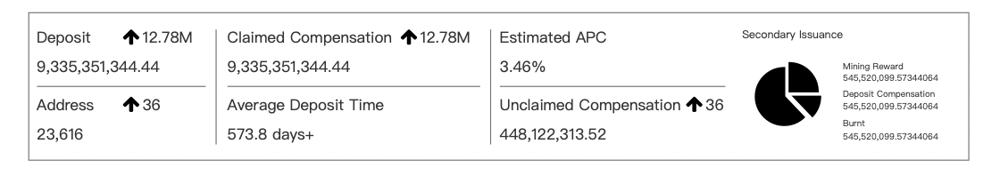
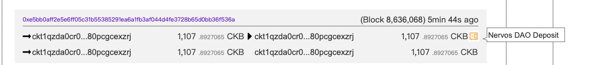
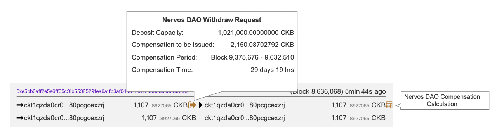
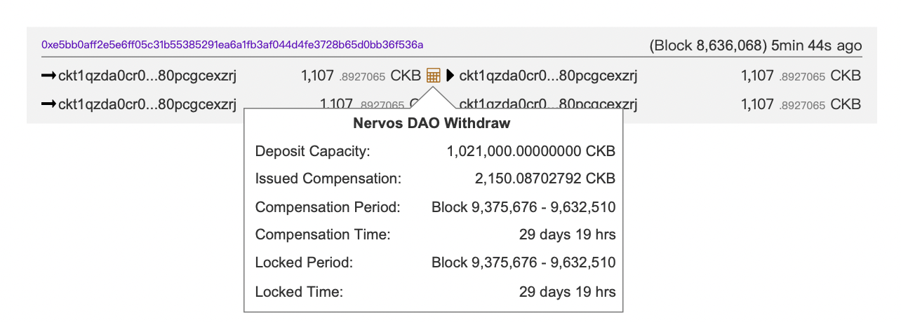
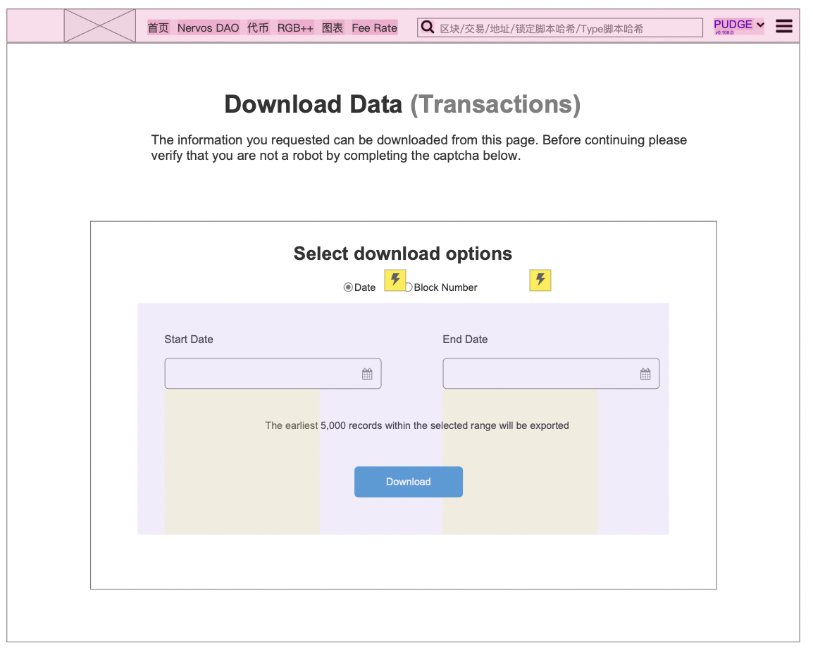
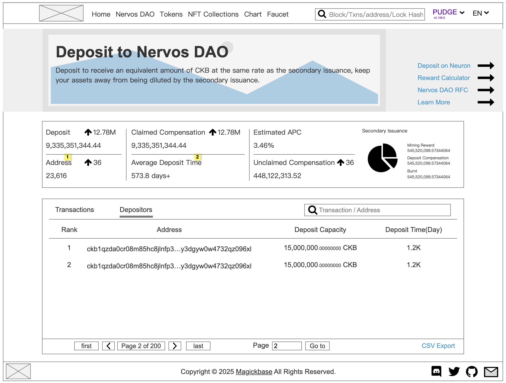
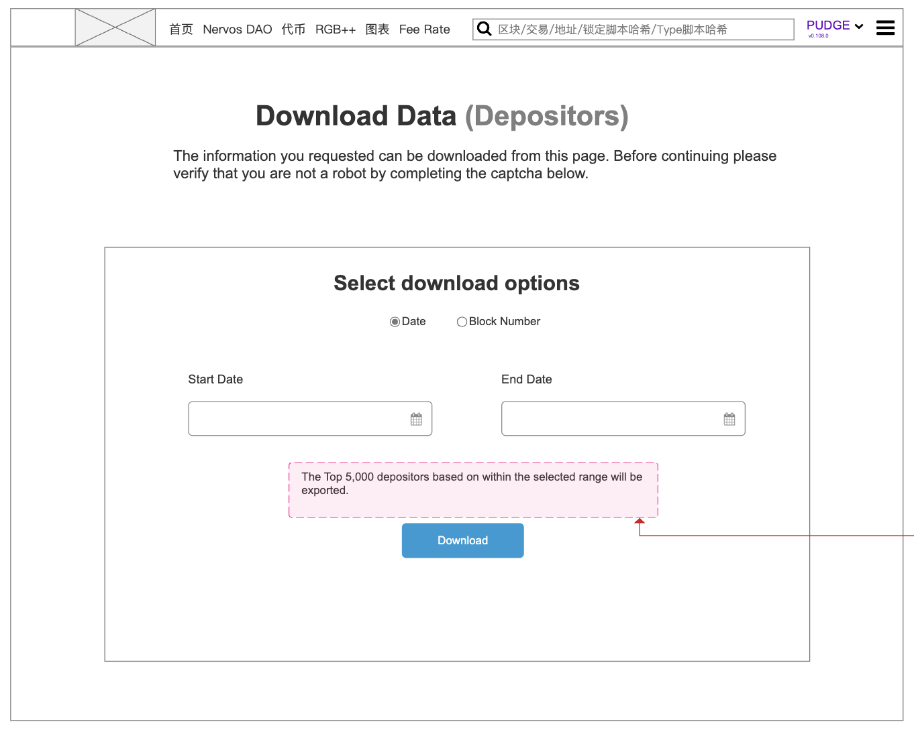

## Page Overview

  

The Nervos DAO page presents a comprehensive view of CKB deposited in the **Nervos DAO**, allowing users to understand their deposit activities, compensation mechanisms, related transactions and the depositor rank.

### Goals

* **(P0)** Display global DAO metrics such as total deposits, claimed compensation, and average deposit time.
* **(P0)** Visualize individual deposit and withdrawal transactions in a user-friendly format.
* **(P1)** Provide detailed insight into each Nervos DAO transaction, including compensation calculations and lock time.
* **(P1)** DAO Calculator: Help users evaluate their unclaimed rewards based on the secondary issuance mechanism.
* **(P0)** Support CSV data export and address-specific filtering.

## Version History / Requirement Tracking

| Version | Date       | Status | Notes                                               |
| ------- | ---------- | ------ | --------------------------------------------------- |
| 1.0     | 2025-07-15 | Draft  | Initial version based on UI screenshot and features |

## Page Constitution

### Header

  

* Title: **Deposit to Nervos DAO**
* Subtitle: 
  * Deposit to receive an equivalent amount of CKB at the same rate as the secondary issuance, keep your assets away from being diluted by the secondary issuance.
* Quick links:
  * Deposit on Neuron(Removed)
  * Reward Calculator: A pop up window to show how much you might gain from deposit
  * [Nervos DAO RFC](https://github.com/nervosnetwork/rfcs/blob/master/rfcs/0023-dao-deposit-withdraw/0023-dao-deposit-withdraw.md)
  * [Learn More](https://www.nervos.org/knowledge-base/nervosdao_withdrawal_process_explained)

### Reward Calculator
User enter the deposit amount, and the withdraw amount will be shown for his/her reference.

  

### Global DAO Statistics (Top Summary Cards)

  

* **Deposit**: Total CKB deposited and its daily change
* **Claimed Compensation**: Total rewards claimed and its daily change
* **Estimated APC**: Annual percentage compensation (e.g., 3.46%) and its daily change
* **Address**: Total number of DAO depositor addresses and its daily change.
* **Average Deposit Time**: Days of average deposit duration. #todo To check if it's Token amount weighted value.
* **Unclaimed Compensation**: Aggregated compensation pending withdrawal.
* **Secondary Issuance Section**: Pie chart showing Secondary Issuance breakdown:
  * Mining Reward
  * Deposit Compensation
  * Burnt

### Tabs Section

* **Tabs**:
  * `Transactions`: Shows DAO deposit & withdraw tx history
  * `Depositors`: List of addresses involved in DAO deposits
* Address filter input box is available

### Transaction Table

* **Columns**:
  * **Tx Hash**: Clickable, links to transaction details
  * **Inputs / Outputs**: ckb addresses with CKB amount.
  * **Capacity**: Amount in CKB
  * **Block Info**: Block height and timestamp
  * **Input/output tags**: 
    * These tags are used for indicating the type of the input/output cell.
    * `Nervos DAO Deposit` icon , 
    * `Nervos DAO Withdraw` icon ,
    * `Nervos DAO Deposit` icon,
    * `Nervos DAO Compensation Calculation` icon
* Method to **Export CSV**

#### Nervos DAO Deposit Tooltip

  

The first transaction a user made to deposit will show the deposit icon, hover the icon, we have "Nervos DAO Deposit" shown.

#### Nervos DAO withdraw request Tooltip

  

The second transaction a user made to request to withdraw will show this icon. Hover the icon, we have information shown:
  * **Deposit Capacity** 
  * **Compensation to be Issued** 
  * **Compensation Period** (e.g., Block 9,375,676 - 9,632,510)
  * **Compensation Time** (e.g., 29 days 19 hrs)

#### Nervos DAO withdraw Tooltip

The third transaction a user made to withdraw will show this icon. Hover the icon, we have information shown:
  
* Deposit Capacity
* Issued Compensation
* Compensation Period
  Format: Block [Start Height] - [End Height]
* Compensation Time
* Locked Period
* Locked Time

#### CSV Export
  
* Exports filtered or complete DAO transaction table data to `.csv`
* Includes
  * Txn hash
  * addresses
  * Blockno
  * Method
  * Amount
  * Token
  * TxnFee(CKB)
  * UnixTimestamp
  * date(UTC)
* Two options are provide for users
  * Range by Block Number
  * Range by Date

### Depositor Tab

  

This tab shows the top depositors, their deposit amount and deposit period.

#### Table Columns

* Rank
* Address (masked in the middle)
* Deposit Capacity (with 8 decimal precision)
* Deposit Time (in days, shorthand like “1.2K”)

#### assistance methods
- Search Bar
- Filter by transaction or address

#### CSV Export
*   
* Exports filtered or complete DAO depositor table data to `.csv`
* Includes
  * Address
  * Capacity
* Two options are provide for users
  * Range by Block Number
  * Range by Date

