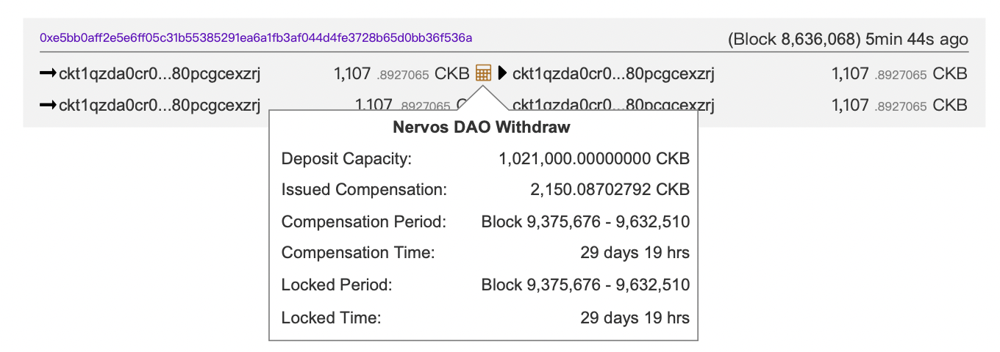

## 1. Page Overview
  
The **CKB Explorer Running Configuration** page provides real-time resource monitoring and recommended server configuration to help node operators and developers.

### 1.1. Goals

* **(P1)** Allow users to monitor current ckb explorer resource usage (CPU, memory, etc.) via a line chart.
* **(P0)** Provide actionable server configuration recommendations for minimum, recommended, and high-load usage scenarios.

## 2. Version History / Requirement Tracking

| Version | Date       | Status | Notes                              |
| ------- | ---------- | ------ | ---------------------------------- |
| 1.0     | 2025-07-18 | Draft  | Initial version based on prototype |

---

## 3. Page Constitution

### 3.1. Menu

See [menu](../GeneralComponents/Menu.md)

### 3.2. Page Title and Subtitle

* **Main Title**: CKB Explorer Running Configuration
* **Subtitle**: Real-time Monitoring and Resource Recommendations

### 3.3. Resource Usage Section

This section shows the chart from grafana.

* **Section Header**: "Resource Usage"
* **Dropdown Selector**: Switch between different metrics 
  * CPU:default
  * Memory
* **Line Chart Panel**:
  * Displays real-time usage over time

  
### 3.4. Recommended Server Configuration Section

Grouped into four major configuration panels, each showing minimum, recommended, and high-load requirements.

#### A. CPU Configuration

* **Minimum**: 4 cores (2.4GHz+)
* **Recommended**: 8 cores (3.0GHz+)
* **High Load**: 16 cores (3.5GHz+)
* **Note**: CPU usage will be higher during initial sync but decreases significantly afterward.

#### B. Memory Configuration

* **Minimum**: 16GB
* **Recommended**: 32 GB
* **High Load**: 64 GB
* **Note**: Memory usage scales with transaction volume.

#### C. Storage Configuration

* **Current Block Size**: \~126GB 
* **Annual Growth Estimate**: \~5–10 GB
* **Recommended**: 1000G
* **Note**: SSD significantly improves syncing and query performance.

#### D. Network Requirements

* **Initial Sync**: 100 Mbps+ (Recommended: 50 Mbps minimum)
* **Daily Operation**: 5 Mbps+
* **High Load / API**: 100 Mbps+
* **Note**: Higher bandwidth reduces initial sync time.

