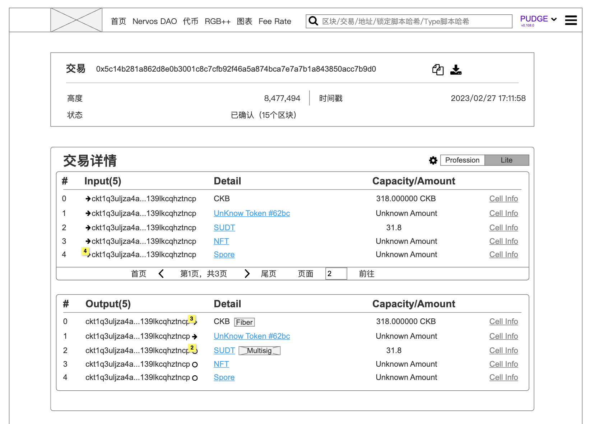

## 1. Page Overview

This page is the **Transaction Details Page** in the CKB explorer. It is designed to display structured information of a single transaction, including its hash, block height, status, timestamp, and detailed input/output Cell data (such as script types, capacity, token types, and links to further info). 

  

### 1.1. Goals

* **(P0)** Display basic transaction information: transaction hash, block height, confirmation status, and timestamp.
* **(P0)** Provide functionality to download raw transaction data.
* **(P0)** Display all Input/Output Cells in structured table format.
* **(P1)** Provide links to detailed views of each Cell.
* **(P1)** Identify and label token types (e.g., SUDT, NFT) in output details.
* **(P2)** Support toggle between “Professional” and “Lite” display modes.

## 2. Version History / Requirement Tracking

| Version | Date       | Status  | Notes                                                            |
| ------- | ---------- | ------- | ---------------------------------------------------------------- |
| v1.0    | 2025-07-21 | Drafted | Initial version based on wireframe design                        |
| v1.1    | TBD        | WIP     | To add description about the rule of Lite mode.|

## 3. Page Constitution

### 3.1. Header Area

  

* Main title: “Transaction”
* Display transaction hash with copy button and provide download method.
* Show block height, confirmation status and number of confirmations
  *  Confirmed 
  *  Pending
  *  Rejected
* Show transaction timestamp (from the block header)

### 3.2. Transaction Detail Pannel

  

Transaction Detail Pannel is composed by 2 sections:
-  Input Section: Showing the info about the input cells
-  Output Section: Showing the info about the output cells

* Table format displaying all input/output Cells:

  * `#`: Serial number
  * `Address`: Source address of the input
    *  Clickable: Jump to the [Address detail page](AddressDetail.md)
  * `Detail` (Also called `Scripts Note`): 
    * The Detail attribute is designed for showing detail of attribution of aboth Lock script and Type script of the Cell
      * The attribution of the type script
        *  If the cell is of UDT (e.g., CKB, SUDT, NFT, Spore), then the UDT name is displayed
           *  Meanwhile, the icon or names are clickable which leads user to the UDT detail page.
        *  #todo If the cell is of Nervos DAO, then the DAO Icon/name should be displayed
      * Shown with tag-style labels; 
  * `Capacity/Amount`: Capacity (CKB) or token amount
  * Rules about `Detail` and `Capacity/Amount`
  *   

    * Scripts Note refers to the annotations for the scripts in the Input/Output sections. In the prototype, this is represented by the gray rounded rectangle. Its interaction follows the Iteration 8 icon behavior.
    * For NFTs (including both DOB and non-DOB types), the Collection Name should be displayed in the Detail column. Clicking it should navigate to the corresponding NFT Collection Page.
    * For NFTs (including both DOB and non-DOB types), the ID of the item should be shown in the Amount column. If it's a DOB, clicking it should navigate to the corresponding Token Page.
    * For UDTs, the Token Name should be displayed in the Detail column. Clicking it should navigate to the corresponding Token Detail Page.
    * For UDTs, the Token Amount should be displayed in the Amount column.
      * “Cell Info” link leads to full details of the input Cell

### 3.3. Display Mode Toggle (Lite / Professional)

* Toggle switch at top-right corner
* **Professional mode**: shows full script details and technical fields
* **Lite mode**: group the transaction input/output by addresses.
     

